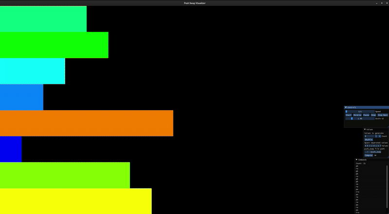
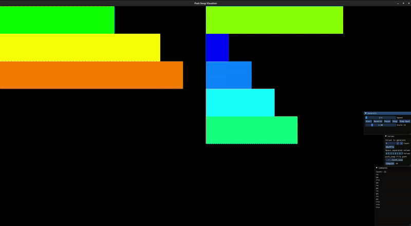
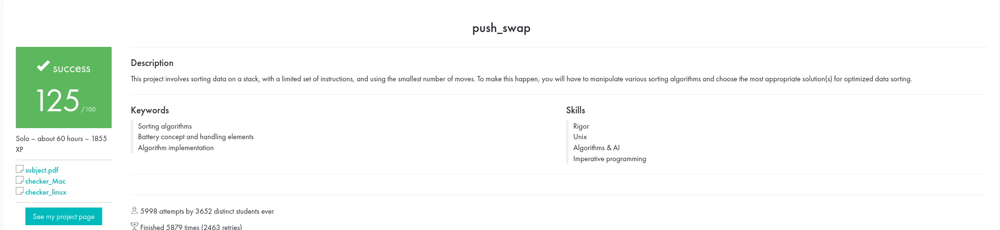

# push_swap

A stack-sorting program written in C as part of the 42 Common Core curriculum.
The project simulates sorting a stack using a limited set of operations, aiming to find the shortest sequence of moves to sort integers in ascending order.

---

## Features
### Stacks & Operations
#### Stacks
+ a: Initially contains a list of unique integers (positive and/or negative).
+ b: Initially empty.

#### Available operations
+ sa / sb: Swap the first two elements of stack a / b.
+ ss: sa and sb at the same time.
+ pa / pb: Push the top element from b to a or from a to b.
+ ra / rb: Rotate stack a / b upwards.
+ rr: Rotate both stacks upwards.
+ rra / rrb: Reverse rotate stack a / b.
+ rrr: Reverse rotate both stacks.

> The goal is to sort stack a in ascending order with the fewest operations.
---

## Project Structure

```
├── libft/              # Dependency (libft project)
├── src/                # Core implementation
├── bonus/              # Bonus checker
├── Makefile
└── README.md
```

---

## Installation

### Clone and build
```bash
git clone https://github.com/ngaurama/push_swap.git
cd push_swap
make && make bonus
```
This will generate the executables:

`push_swap` and `checker`

### Usage

Sorting a stack
```
./push_swap 2 1 3 6 5 8
```
Output:
```
pb
pb
pb
sa
pa
pa
ra
pa
rra
```

Checking output with the bonus checker:
```
ARG="2 1 3 6 5 8"
./push_swap $ARG | ./checker $ARG
```
Output from checker if sorted correctly:

`OK`

Else:

`KO`

---

### Benchmarks
To pass the evaluation, your program must meet these limits:
+ 100 numbers: 
    + Required: fewer than 700 operations (max)
    + My Algorithm: average of 575 operations

+ 500 numbers: 
    + Required: fewer than 5500 operations (max)
    + My Algorithm: average of 4500 operations

### Viewer for my algorithm
#### 100 Numbers: 

+ Average operations: 575

##### 500 Numbers:

+ Average operations: 4500

---

### My Algorithm

My push_swap algorithm is a hybrid approach that combines an initial partitioning phase with a cost-based insertion sort. The core idea is to reduce the problem size quickly by pushing elements to stack B, sort the remainder of stack A, and then smartly re-insert elements from stack B back into stack A with the fewest operations possible.

#### Step 1: Preprocessing & Indexing

Before any sorting operations begin, the algorithm preprocesses the input list of numbers. It assigns each number a normalized index based on its relative value.
+ Why? Sorting becomes much easier when you only need to deal with a continuous range of numbers (e.g., 0 to 499 for a  500-number list) instead of potentially large and random or negative values.

+ How? The original stack is copied into an array of structs containing the original value and its index. This array is sorted using a simple Bubble Sort. The sorted order determines the new index for each original position. The smallest number becomes 0, the next becomes 1, and the largest becomes size - 1.

+ Example: The input [500, -100, 0] is converted into the normalized stack [2, 0, 1].

#### Step 2: Initial Partitioning to Stack B

The goal of this phase is to quickly reduce stack A to a small, manageable size (3 elements) so it can be sorted trivially.

+ For lists larger than 6 elements, the algorithm pushes roughly the first half of the numbers to stack B.
    + It uses a simple check: If the normalized value at the top of stack A is in the lower half of the range, it is pushed to B (pb).
    + If it's in the upper half, stack A is rotated (ra) to bring the next element to the top, effectively "scanning"
    for the next number that should be pushed to B.
    + This process continues until only 3 elements remain in stack A.
        - Example: Let's take the stack [3 4 2 1 7 0 5 6]
        - The algorithm checks if the top number is in the lower half of the range (0-7). Numbers 0, 1, 2, 3, 4 are in the lower half.
            1. Top of A is 3. It is in the lower half. `pb` -> Stack A: `[4 2 1 7 0 5 6]`, Stack B: `[3]`
            2. Top of A is 4. It is not in the lower half. `ra` -> Stack A: `[2 1 7 0 5 6 4]`, Stack B: `[3]`
            3. Top of A is 2 and then 1. Both are in the lower half, so push them both. Stack A: `[7 0 5 6 4]`, Stack B: `[1 2 3]`
            4. Top of A is 7. It is not in the lower half. `ra` -> Stack A: `[0 5 6 4 7]`, Stack B: `[1 2 3]`
            5. Top of A is 0. It is in the lower half. `pb` -> Stack A: `[5 6 4 7]`, Stack B: `[0 1 2 3]`
            6. Now comes a tricky part, we only check if its in the lower half as long as the pushed numbers is less than half the range. This saves on a number of moves as we try to pragmatically go for the option that makes the Stack A have 3 values as quickly as possible while still efficiently pushing to B.
            7. So, since `pushed(4)` is no longer less than `size/2 (4)` we just keep pushing whatever is on top of A to B until there are 3 numbers remaining in A. So now we do, `pb` -> Stack A `[6 4 7]`, Stack B: `[5 0 1 2 3]`
+ These final 3 elements in stack A are then sorted using a hardcoded algorithm for 3 numbers (sort_three).
    + So final stacks after pushing to B and sorting 3 numbers in A in the least moves possible:
        + Stack A: `[4 6 7]`, Stack B: `[5 0 1 2 3]`
    
+ Operations so far: `pb ra pb pb ra pb pb sa`
    
+ Visualization of everything that happened till now:



### Step 3: Cost-Based Insertion Back to Stack A

With stack A sorted and stack B filled, the algorithm now needs to push all elements from B back to A in the correct order. This is the most complex part.

+ For each element in stack B, the algorithm must find:

    + Its Target Position in A: For a given number in B, its correct position in the sorted stack A is immediately above the smallest number in A that is larger than it. The find_target_in_a function calculates this. If the number is larger than the max or smaller than the min in A, its target is the position of the min value (which becomes the new min/max after insertion).

    + The Cost to Move It: The calculate_cost function determines the number of operations required to bring both the target element in B and its target position in A to the top of their respective stacks.

        The cost for a stack is the number of rotates (ra/rb) or reverse rotates (rra/rrb) needed.

        Key Insight: If both elements need to be rotated in the same direction (e.g., both need ra/rb or both need rra/rrb), their movements can be combined into a single simultaneous operation (rr or rrr), reducing the total cost. The cost calculation accounts for this optimization.

+ The algorithm then executes a loop until stack B is empty:

    Find the Cheapest Element: It calculates the cost for every element in stack B to find the single cheapest element to move (the one with the lowest total operation count).

    Execute the Moves: Using rotation_logic, it performs the necessary rotations on both stacks to bring the cheapest element in B and its target position in A to the top. It uses simultaneous rotations (rr/rrr) whenever possible for efficiency.

    Push: The element is pushed from B to A (pa).

+ Example continued: 
  + Current State:
    + Stack A (Sorted): `[4, 6, 7]`
    + Stack B: `[5, 0, 1, 2, 3]`

  + The algorithm now enters the main loop: `while (stacks->size_b > 0)`. It will calculate the cost to push each element in B and find the cheapest one.

  + Let's analyze the cost for each element in Stack B (5, 0, 1, 2, 3):

    + Element 5 (index 0 in B):

        + Target in A: Find where 5 belongs in A [4, 6, 7]. It's larger than 4 and smaller than 6. Its target is the position of 6, which is index 1.
        + Cost in B (cost_b): Index is 0. To bring it to top: 0 rotates (rb). cost_b = 0.
        + Cost in A (cost_a): Target is index 1. To bring it to top: 1 rotate (ra). cost_a = 1.
        + Total Cost: 0 + 1 = 1.

    + Element 0 (index 1 in B):

        + Target in A: 0 is smaller than the min in A (4). By the edge case, its target is the position of the min in A. The min 4 is at index 0.
        + Cost in B (cost_b): Index is 1. To bring it to top: 1 rotate (rb). cost_b = 1.
        + Cost in A (cost_a): Target is index 0. It's already on top! cost_a = 0.
        + Total Cost: 1 + 0 = 1.

    + Element 1 (index 2 in B):

        + Target in A: Also smaller than min (4). Target is index 0.
        + Cost in B (cost_b): Index is 2. To bring it to top: 2 rotates (rb) or 2 reverse rotates (rrb)? The cheapest is 2 rb (since 2 <= 5/2). cost_b = 2.
        + Cost in A (cost_a): Target is index 0. cost_a = 0.
        + Total Cost: 2 + 0 = 2.

    + Element 2 (index 3 in B):

        + Target in A: Also smaller than min (4). Target is index 0.
        + Cost in B (cost_b): Index is 3. To bring it to top: 3 rb or 2 rrb? 2 is cheaper. cost_b = 2.
        + Cost in A (cost_a): cost_a = 0.
        + Total Cost: 2 + 0 = 2.

    + Element 3 (index 4 in B):
        + Target in A: Also smaller than min (4). Target is index 0.
        + Cost in B (cost_b): Index is 4. To bring it to top: 1 reverse rotate (rrb) is cheapest. cost_b = 1.
        + Cost in A (cost_a): cost_a = 0.
        + Total Cost: 1 + 0 = 1.

  + The cheapest elements are 5 (cost 1) and 0 (cost 1) and 3 (cost 1). 
    + The algorithm will pick the first one it finds with the lowest cost, which is 5 at index 0.
    + Executing the Move for 5:
        + Target in A is index 1 (the value 6).
        + Cost: cost_b = 0 (do nothing to B), cost_a = 1 (rotate A once).

        + The algorithm performs ra to bring the target position in A to the top.
            + Stack A becomes: [6, 7, 4] (The 4 wraps around)

        + Now it performs pa to push 5 from B to A.

            + Stack A becomes: `[5, 6, 7, 4]`
            + Stack B becomes: `[0, 1, 2, 3]`

  + Operations so far: `... ra pa`

  + The loop continues. Now let's find the next cheapest element with the new stacks:
    + Element 0 (index 0 in B):
        + Target in A: 0 is smaller than the min in A (4). The min 4 is at index 3.
        + Cost in B (cost_b): 0 (already on top).
        + Cost in A (cost_a): Target is index 3. To bring it to top: 1 reverse rotate (rra).
        + Total Cost: 1.

    + The cost for 0 is, again, 1. It's the cheapest.
    + Executing the Move for 0:
        + Target in A is index 3 (the value 4).
        + Cost: cost_b = 0, cost_a = 1 (reverse rotate A).

        + The algorithm performs rra.
            + Stack A becomes: `[4, 5, 6, 7]` (The 4 is now on top)

        + Now it performs pa to push 0 from B to A.
            + Stack A becomes: `[0, 4, 5, 6, 7]`
            + Stack B becomes: `[1, 2, 3]`

  + Operations so far: `... rra pa`

  + The process repeats. The next cheapest element will be 1 (cost 0 to top of B, target is index of element 4 which is 1, cost 1 to ra). The algorithm will push the rest in an efficient order, likely 1, then 2, then 3, using a combination of rotates and pushes.

  + Final Push Sequence (simplified):
    + Push 1: ra pa -> A is `[1, 4, 5, 6, 7, 0]`
    + Push 2: ra pa -> A: `[2, 4, 5, 6, 7, 0, 1]`
    + Push 3: ra pa -> A: `[3, 4, 5, 6, 7, 0, 1, 2]`
  + Operations so far: `... ra pa ra pa ra pa`

+ Visualization of everything that happened till now:



### Step 4: Final Rotation

After all elements are pushed back to stack A, the stack is sorted but might not be in the correct rotation. The smallest element might not be at the top.
+ The shift_till_sorted function finds the index of the smallest element.
+ It then performs either ra or rra operations until the smallest element is at the top, resulting in a perfectly ascending stack.

+ Example continued: 
    + We just need to reverse rotate a thrice for it to be sorted.
    + Operations: `rra rra rra`. 
    + Stack A: `[0, 1, 2, 3, 4, 5, 6, 7]`

And voila! The stack is sorted and the algorithm is quite efficient

+ Visualization of everything that happened till now:


---

### Learning Outcomes

Through this project, I gained experience with:
+ Implementing stack data structures in C
+ Designing efficient sorting algorithms under strict operational constraints
+ Managing program output for automated evaluation

---

### Evaluation


---
## Author
+ Nitai Gauramani
  - 42 Paris – Common Core project <br>


